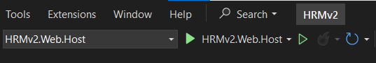
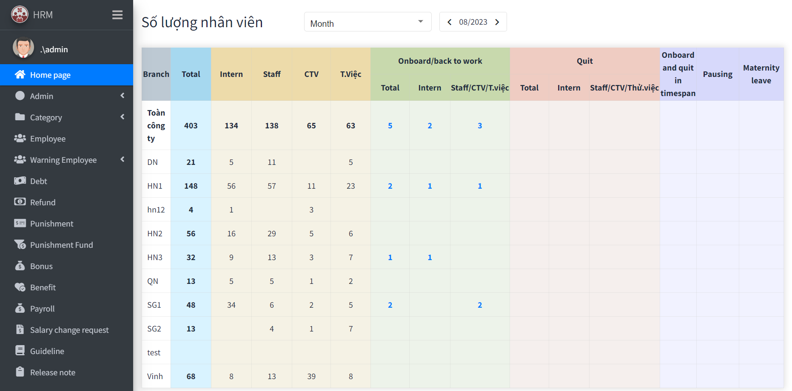
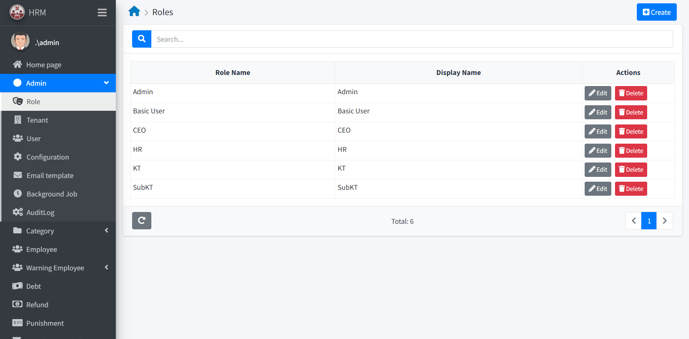
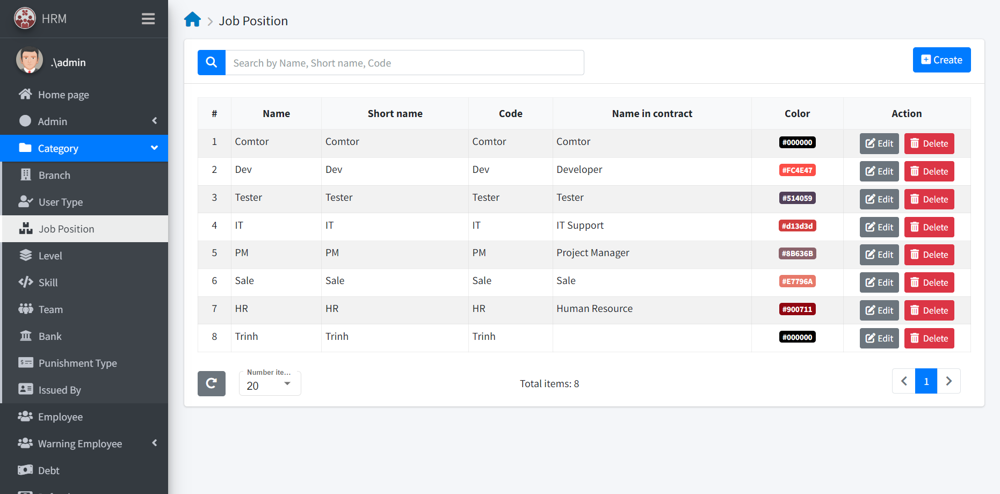
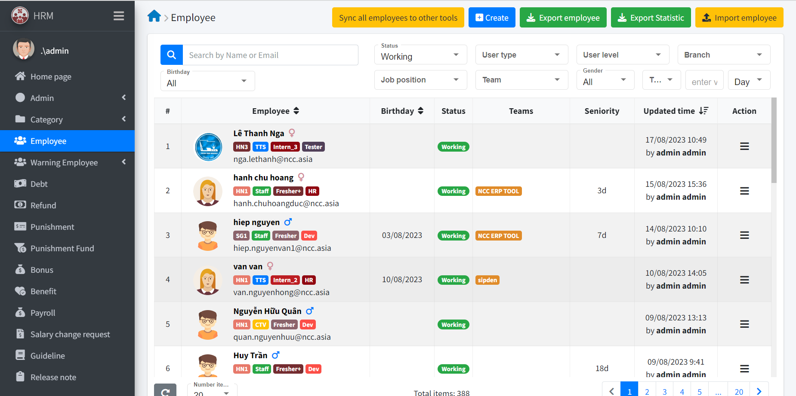
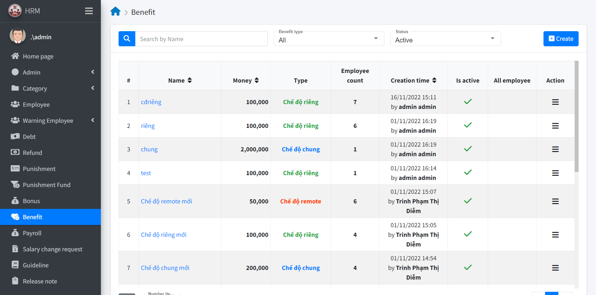
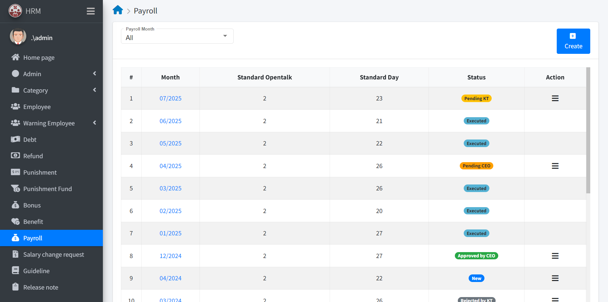

# HRMv2
## Overview
**Human Resource Management** (HRM) is a comprehensive software solution designed to assist businesses in efficiently managing and developing their human resources. With its wide range of functionalities, HRM enables organizations to streamline employee information, encompassing essential details such as basic information, debts, refunds, penalties, bonuses, benefit, and payroll. From the initial stages of recruitment and onboarding to ongoing training, performance improvement, and promotions, HRM facilitates a seamless process. By leveraging the power of comprehensive and detailed employee data, businesses can effectively evaluate performance, identify areas for improvement, and strategically define their human resource development strategies. HRM serves as a valuable tool for optimizing workforce management and driving organizational success..

## Table of Contents
- [Getting Started](#getting-started)
  - [Prerequisites](#prerequisites)
  - [Backend Setup](#backend-setup)
  - [Frontend Setup](#frontend-setup)
  - [Running](#running)
- [Screenshots](#screenshots)
- [License](#license)

## Getting Started

### Prerequisites
Before you begin, ensure you have met the following requirements:
- [Visual Studio 2022](https://visualstudio.microsoft.com/fr/downloads/) installed
- [Visual Studio code](https://code.visualstudio.com/) installed
- [PostgreSQL](https://www.postgresql.org/download/) installed
- [Node 14.20.0](https://nodejs.org/en/blog/release/v14.20.0) installed
- [.NET Core 3.1 SDK](https://dotnet.microsoft.com/en-us/download/dotnet/3.1) installed
- [Git](https://www.git-scm.com/downloads) installed
### BackEnd Setup
1. **Create a folder** to store project code
- Ex: **ncc-erp-hrmv2** folder
2. **Clone project** in this created folder, `Right Click` and select `Git Bash Here` to use the following command: 
```bash
git clone https://github.com/ncc-erp/ncc-erp-hrm-v2.git
```
3. Open the **HRMv2 Solution** using **Visual Studio 2022**:

- Launch **Visual Studio 2022**.
- Select `File` > `Open` > `Project/Solution.`
- Navigate to the **aspnet core** folder within created folder **ncc-erp-hrmv2** and open the **HRMv2.sln** file.

4. Set the Startup Project:
- At **Solution Explorer** (or you can open it by using `ctrl+alt+L`), open **src** folder
- `Right Click` on **HRMv2.Web.Host**  and choose `Set as Startup Project`

5. Create a local Database
- Launch **PostgreSQL** and connect to your Local Database: **Servers** > **PostgreSQL**
- `Right Click` on **Databases** folder and choose `Create` > `Database...` with database name such as: *HRMv2*

6. Update some Setting files
- Navigate to **HRMv2.Web.Host** > **appsettings.json** and config the **ConnectionStrings** (with Host, Port, User ID, Password created when you install PostgreSQL) like this:
```bash
"ConnectionStrings": {
    "Default": "Host=localhost;Port=5432;Database=HRMv2;User ID=postgres;Password=123456;Pooling=true;"
  }
```
You also have to set other paramaters here when you need.
- **HRMv2.Web.Host** > **appsettings.json** > **appsettings.Staging.json**
```bash
"ConnectionStrings": {
    "Default": "Server=localhost; Database=HRMv2; User=postgres; Password=123456;"
  }
```

7. Update Database
- Open **Tool** > **Command Line** > **Developer Command Prompt**
- Navigate to **EntityFrameworkCore** folder, by using command:
```bash
cd src
```
```bash
cd HRMv2.EntityFrameworkCore
```
- Download **Entity Framework Core CLI** globally
```bash
dotnet tool install --global dotnet-ef
```
- Update database
```bash
dotnet ef database update
```
8. At **Startup Projects** choose **HRMv2.Web.Host**

9. Run the project
- Choose **Debug** > **Start Debuging** (`F5`) or **Start without Debuging** (`ctrl+F5`) to run the backend project.
10. Change Login Setting for the first time
- At Swagger UI, `Authorize` with account (leave Ternancy Name empty):
```bash
Username: admin
Password: 123qwe
```
- Select `/api/services/app/Configuration/ChangeLoginSetting` api, `Try it out` and `Execute` it, make sure that value of **enableNormalLogin** is true:
```bash
{
  "googleClientId": "string",
  "enableNormalLogin": true
}
```

### FrontEnd Setup
1. Open **Angular** folder using **Visual Studio Code**
- Launch **Visual Studio Code**
- **File** > **Open folder...** (`ctrl+K+O`)
- Choose the **Angular** folder within created folder **ncc-erp-hrmv2**

2. Change Url
- At **appconfig.json** change "https" to "http"
```bash
"remoteServiceBaseUrl": "http://localhost:44311",
```

3. Install frontend dependencies
- Select **Terminal** > **New Terminal**
- Using this command:
```bash
npm install
```
- Then 
```bash
npm audit fix
```

4. Install Angular CLI 12.0.5 globally
```bash
npm install -g @angular/cli@12.0.5
```

5. Run the frontend project
```bash
node --max-old-space-size=4096 ./node_modules/@angular/cli/bin/ng s -o
```
6. Login
- Login with the default account:
```bash
Username: admin
Password: 123qwe
```

### Running
To run the project, use these commands:

1. Start the backend using `Visual Studio Code` or the `command line`.

2. Start the frontend:

```bash
node --max-old-space-size=4096 ./node_modules/@angular/cli/bin/ng s -o
```

## Screenshots
HRMv2 tool has varios function for you to manage your company's Human Resource, such as:
- Homepage

- As an Admin, you can manage some features: Role, Ternant, User...

- Manage categories: Branch, User Type, Job Position...

- Employee

- Manage Warning Employee, Debt, Refund, Punishment, Bonus, Benefit...

- Manage Payroll of employee

## License
[MIT License](./LICENSE)
